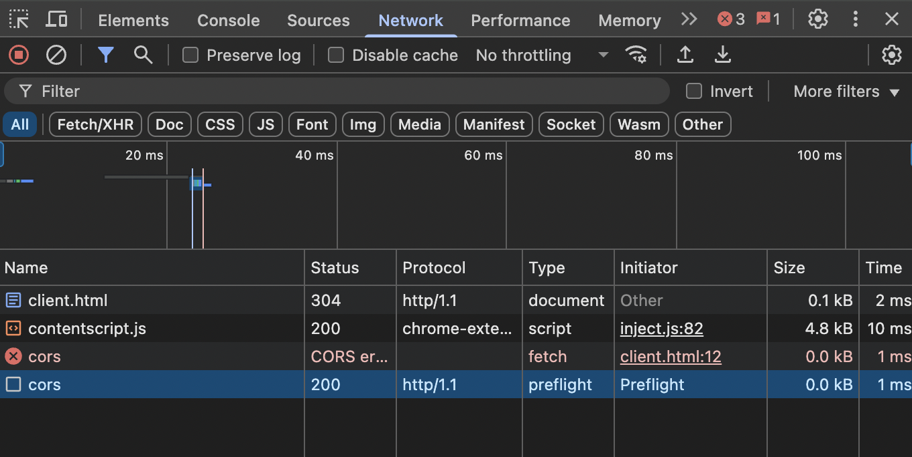
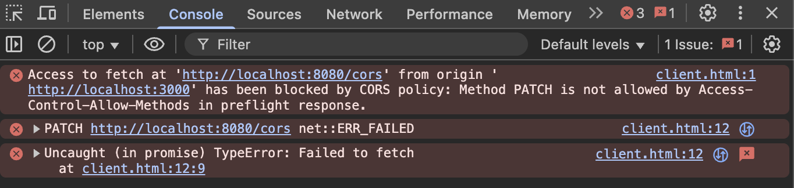
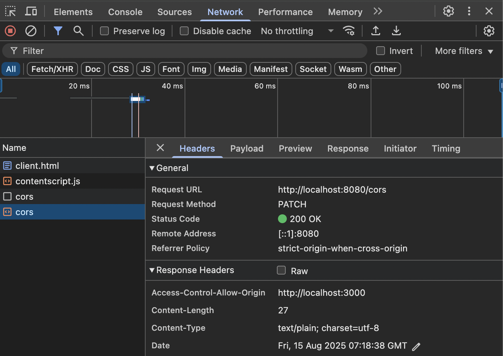

# Cross Origin Resource Sharing(CORS)
If you are reading this book and trying to test the contents using a client-side web application written in JavaScript(or some frameworks like React), you would probably hit [CORS](https://developer.mozilla.org/en-US/docs/Glossary/CORS)-related error messages(usually on your Chrome Console tab) as follows:

> Access to fetch at 'http://localhost:8080/cors' from origin 'null' has been blocked by CORS policy: No 'Access-Control-Allow-Origin' header is present on the requested resource.

Actually it is one of the errors that a lot of web developers face in their early learning times - especially trying to build a full-stack web application using React and a backend stack like Node or Django. Usually, they just get over it by either tweaking some response headers or installing a new package at all. 

However, CORS is actually an important concept in web technology and we need to know how it works for secure applications. In this chapter, we'll cover how we handle this CORS issue simply. 

## Initial Setups

For this example, we start with the following client and server side settings respectively:

- client-side(`client/client.html` and `client/server.go`)
```html
<!DOCTYPE html>

<head>
    <title>Test Cors</title>
</head>

<body>
    <div class="test"></div>
    <script>
        const testDiv = document.querySelector(".test");

        fetch("http://localhost:8080/cors", { method: "GET" })
            .then(res => res.text())
            .then(text => {
                testDiv.innerHTML = text;
            });
    </script>
</body>

</html>
```

```go
package main

import (
	"log"
	"net/http"
)

func main() {
	http.Handle("/", http.FileServer(http.Dir(".")))

	log.Fatal(http.ListenAndServe(":3000", nil))
}

```

- server-side(`server.go`)
```go
package main

import (
	"fmt"
	"log"
	"net/http"
)

func main() {
	http.HandleFunc("/cors", func(w http.ResponseWriter, r *http.Request) {
		fmt.Fprintln(w, "testing cors successfully!")
	})

	log.Fatal(http.ListenAndServe(":8080", nil))
}
```

## Simulate the Resource Sharing with 3rd-party Application
First, run the `client/server.go` by moving to `client` directory and run `go run .`. This "client server" simulates the **Sus** website that you visit, by providing the `client.html` file to **Br**.

Next, run `server.go`. This represents the resource sharing 3rd-party application server. 

Finally, go to your browser and visit `http://localhost:3000/client.html`, then you'll see the following messages on your Chrome Console tab:


## Brief and Simple Summary of CORS
There are so many good articles and posts(for example, from [AWS](https://aws.amazon.com/what-is/cross-origin-resource-sharing), and [MDN](https://developer.mozilla.org/en-US/docs/Web/HTTP/Guides/CORS)), I won't try to explain everything from begging. But I feel it is necessary to understand the big picture of why we have this for our security(and why it makes me write this rather long article!).

There are at least three entities involved:
- your browser(**Br**)
- a suspicious website(**Sus**) from which your browser downloads bunch of HTML, CSS, and JavaScript code files
- a third party application server(**Th**), usually providing some kind of resources such as your bank account information or your authentication information

When **Br** visits **Sus**, it runs the JavaScript code that **Sus** provides. Inside the code, there could be resource-requesting logic such as [`fetch`](https://developer.mozilla.org/en-US/docs/Web/API/Fetch_API/Using_Fetch) against **Th**. Once the request has sent to **Th**, there will be a response from **Th** to **Br**, that will be shared with the JavaScript code from **Sus**.

Now, as my abbreviation suggests, can you trust **Sus**? What if it is a phishing website that clones the homepage of one of the banks that you use? CORS is a mechanism that tries to prevent this **Sus** to eavesdrop sensitive information of users like you. 

But how? Your sensitive data is managed by **Th**, so **Th** can take actions. CORS inforces **Th** to specify the domain(=protocol + host + port) in a response header `Access-Control-Allow-Origin`. If **Th** thinks that **Sus** is credible, then it specifies the domain of **Sus** inside the `Access-Control-Allow-Origin` header. Then **Br** sees this header in the response from **Th**, and allows **Sus** to share the response data.

Now, let's fix our code by specifying `Access-Control-Allow-Origin` header.

## Specifying `Access-Control-Allow-Origin` Header

In our Go code, set the header as follows:

```go
// [...]
http.HandleFunc("/cors", func(w http.ResponseWriter, r *http.Request) {
    // add the client-side domain to the header
    w.Header().Add("Access-Control-Allow-Origin", "http://localhost:3000")
    fmt.Fprintln(w, "testing cors successfully!")
})
// [...]
```

Note that we used `w.Header().Add` instead of `w.Header().Set`, since we could have multiple origins to allow sharing the resources.

Now, re-run `server.go` and re-visit `http://localhost:3000/client.html`. What happens? You'll see the text message "`testing cors successfully!`" without any erorr messages on the Console tab:


This means that the server acknowledges it is safe to share the resources it provides with the client side JavaScript code. Wow, is that this simple?!

## Preflight Requests
There could be some cases in which a user may want to change the resources in **Th**. Then rather than ["simple requests"](https://developer.mozilla.org/en-US/docs/Web/HTTP/Guides/CORS#simple_requests), the JavaScript code of **Sus** needs to send other types of requests. Say the JavaScript code is like:

```js
// [...]
fetch("http://localhost:8080/cors",
    {
        method: "PATCH",
        body: "not simple request",
        headers: {
            "Content-Type": "text/plain",
            "X-My-Header": "foo"
        }
    })
    .then(res => res.text())
    .then(text => {
        testDiv.innerHTML = text;
    });
// [...]
```

Obviously, this is not a simple request. Then **Br** automatically catches this and make a [preflight request](https://developer.mozilla.org/en-US/docs/Glossary/Preflight_request) first to **Th**. 

If you refresh your browser at `http://localhost:3000/client.html` and open the Network tab of the Chrome browser, then you'll see there has been a `OPTION` request has been made to **Th**.



If you click the request part and see "Request Headers" dropdown, there are two notable headers:
- `Access-Control-Request-Headers: x-my-header`: this is the name of the header that we set in the `fetch` request; note that the value of the header is not included
- `Access-Control-Request-Method: PATCH`: this is the method of the request we made

So by making a preflight request, the browser want to make sure whether it is safe to make such a request. But for now, when you check out "Response Headers" dropdown, you don't see any special information.

And if you check the Console tab, the same old error pops up:



> Access to fetch at 'http://localhost:8080/cors' from origin 'http://localhost:3000' has been blocked by CORS policy: Method PATCH is not allowed by Access-Control-Allow-Methods in preflight response.

Even if the preflight request has been successful, the response didn't list the allowed methods and headers, thus the browser denied sharing the response with the JavaScript code.

To fix this issue, the Go server responds to `OPTION` requests as follows:

```go
// [...]
http.HandleFunc("/cors", func(w http.ResponseWriter, r *http.Request) {
    w.Header().Add("Access-Control-Allow-Origin", "http://localhost:3000")

    switch r.Method {
    // preflight
    case http.MethodOptions:
        w.Header().Add("Access-Controll-Allow-Methods", http.MethodGet)
        w.Header().Add("Access-Controll-Allow-Methods", http.MethodOptions)
        w.Header().Add("Access-Controll-Allow-Methods", http.MethodPatch)
        w.Header().Add("Access-Controll-Allow-Headers", "X-My-Header")
        w.WriteHeader(http.StatusNoContent)
    default:
        fmt.Fprintln(w, "testing cors successfully!")
    }
})
// [...]
```

Now re-run the go server and re-visit `http://localhost:3000/client.html`. Then you'll see that the expected response has been delivered:



If you check the Network tab, you'll see that the response to the preflight request include necessary lists of allowed origins, headers, and methods.

For your information, the response to a preflight request is cached in browser, so your browser wouldn't have to make the same preflight request for every single non-simple request.

## Requests with Credentials
The JavaScript code provided by **Sus** can make a request to **Th** with credentials that are provided by the user who is using **Br**, such as cookies(see [this page](https://developer.mozilla.org/en-US/docs/Web/API/Fetch_API/Using_Fetch#including_credentials) for details). For example, if we use `fetch()`, it specifies the option `credentials: "include"` to send the credential data of the user:

```js
// [...]
fetch("http://localhost:8080/cors",
    {
        method: "PATCH",
        body: "not simple request",
        headers: {
            "Content-Type": "text/plain",
            "X-My-Header": "foo",
            "Cookie": "user-session-info"
        },
        credentials: "include", // note that this option is set
    })
    .then(res => res.text())
    .then(text => {
        testDiv.innerHTML = text;
    });
// [...]
```

But it is **Sus** that sends the sensitive information of **Br**, it might be deceiving the user on **Br**. So from the perspective of **Th**, it needs to protect the user from leaking one's important information. 

So without any change in the server logic, if we re-visit `http://localhost:3000/client.html`, we have this following error(for this section, I omit showing the screenshots):

> Access to fetch at 'http://localhost:8080/cors' from origin 'http://localhost:3000' has been blocked by CORS policy: Response to preflight request doesn't pass access control check: The value of the 'Access-Control-Allow-Credentials' header in the response is '' which must be 'true' when the request's credentials mode is 'include'.

If **Th** trusts **Sus**, then in the response against the request, the server sets the header `Access-Control-Allow-Credentials` as `"true"`(a string value), with `Access-Control-Allow-Origin` set as before. In case of the non-simple requests, you need to set the header of the response to the preflight(`OPTION` requests) requests.

Therefore, if we add the following line, the request will be sent successfully again:

```go
// [...]
http.HandleFunc("/cors", func(w http.ResponseWriter, r *http.Request) {
    w.Header().Add("Access-Control-Allow-Origin", "http://localhost:3000")
    w.Header().Add("Access-Control-Allow-Credentials", "true")
    // [...]

})
// [...]
```

## Conclusion
Articles and posts about CORS seem to be complicated and verbose at a glance, but if you understand the mechanism of how the three entities(the browser, the visiting application site, and the third party server), why setting all those headers make sense. 

From now on, instead of keep installing third-party middleware, just set your own CORS headers, which would take a few minutes!

## Exercise
No exercise today! Enjoy reading!
