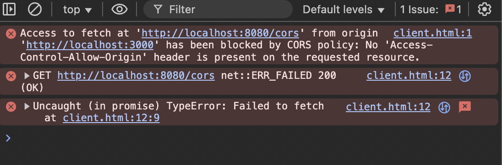
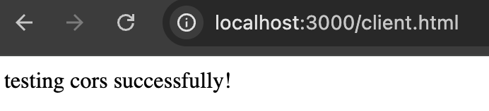

# Cross Origin Resource Sharing(CORS)
If you are reading this book and trying to test the contents using a client-side web application written in JavaScript(or some frameworks like React), you would probably hit [CORS](https://developer.mozilla.org/en-US/docs/Glossary/CORS)-related error messages(usually on your Chrome Console tab) as follows:

> Access to fetch at 'http://localhost:8080/cors' from origin 'null' has been blocked by CORS policy: No 'Access-Control-Allow-Origin' header is present on the requested resource.

Actually it is one of the errors that a lot of web developers face in their early learning times - especially trying to build a full-stack web application using React and a backend stack like Node or Django. Usually, they just get over it by either tweaking some response headers or installing a new package at all. 

However, CORS is actually an important concept in web technology and we need to know how it works for secure applications. In this chapter, we'll cover how we handle this CORS issue simply. 

## Initial Setups

For this example, we start with the following client and server side settings respectively:

- client-side(`client/client.html` and `client/server.go`)
```html
<!DOCTYPE html>

<head>
    <title>Test Cors</title>
</head>

<body>
    <div class="test"></div>
    <script>
        const testDiv = document.querySelector(".test");

        fetch("http://localhost:8080/cors", { method: "GET" })
            .then(res => res.text())
            .then(text => {
                testDiv.innerHTML = text;
            });
    </script>
</body>

</html>
```

```go
package main

import (
	"log"
	"net/http"
)

func main() {
	http.Handle("/", http.FileServer(http.Dir(".")))

	log.Fatal(http.ListenAndServe(":3000", nil))
}

```

- server-side(`server.go`)
```go
package main

import (
	"fmt"
	"log"
	"net/http"
)

func main() {
	http.HandleFunc("/cors", func(w http.ResponseWriter, r *http.Request) {
		fmt.Fprintln(w, "testing cors successfully!")
	})

	log.Fatal(http.ListenAndServe(":8080", nil))
}
```

## Simulate the Resource Sharing with 3rd-party Application
First, run the `client/server.go` by moving to `client` directory and run `go run .`. This "client server" simulates the **Sus** website that you visit, by providing the `client.html` file to **Br**.

Next, run `server.go`. This represents the resource sharing 3rd-party application server. 

Finally, go to your browser and visit `http://localhost:3000/client.html`, then you'll see the following messages on your Chrome Console tab:



## Brief and Simple Summary of CORS
There are so many good articles and posts(for example, from [AWS](https://aws.amazon.com/what-is/cross-origin-resource-sharing), and [MDN](https://developer.mozilla.org/en-US/docs/Web/HTTP/Guides/CORS)), I won't try to explain everything from begging. But I feel it is necessary to understand the big picture of why we have this for our security(and why it makes me write this rather long article!).

There are at least three entities involved:
- your browser(**Br**)
- a suspicious website(**Sus**) from which your browser downloads bunch of HTML, CSS, and JavaScript code files
- a third party application server(**Th**), usually providing some kind of resources such as your bank account information or your authentication information

When **Br** visits **Sus**, it runs the JavaScript code that **Sus** provides. Inside the code, there could be resource-requesting logic such as [`fetch`](https://developer.mozilla.org/en-US/docs/Web/API/Fetch_API/Using_Fetch) against **Th**. Once the request has sent to **Th**, there will be a response from **Th** to **Br**, that will be shared with the JavaScript code from **Sus**.

Now, as my abbreviation suggests, can you trust **Sus**? What if it is a phishing website that clones the homepage of one of the banks that you use? CORS is a mechanism that tries to prevent this **Sus** to eavesdrop sensitive information of users like you. 

But how? Your sensitive data is managed by **Th**, so **Th** can take actions. CORS inforces **Th** to specify the domain(=protocol + host + port) in a response header `Access-Control-Allow-Origin`. If **Th** thinks that **Sus** is credible, then it specifies the domain of **Sus** inside the `Access-Control-Allow-Origin` header. Then **Br** sees this header in the response from **Th**, and allows **Sus** to share the response data.

Now, let's fix our code by specifying `Access-Control-Allow-Origin` header.

## Specifying `Access-Control-Allow-Origin` Header

In our Go code, set the header as follows:

```go
// [...]
http.HandleFunc("/cors", func(w http.ResponseWriter, r *http.Request) {
    // add the client-side domain to the header
    w.Header().Set("Access-Control-Allow-Origin", "http://localhost:3000")
    fmt.Fprintln(w, "testing cors successfully!")
})
// [...]
```

Now, re-run `server.go` and re-visit `http://localhost:3000/client.html`. What happens? You'll see the text message "`testing cors successfully!`" without any erorr messages on the Console tab:



This means that the server acknowledges it is safe to share the resources it provides with the client side JavaScript code. Wow, is that this simple?!

## Preflight Requests

## Other Headers

## Conclusion

## Exercise

